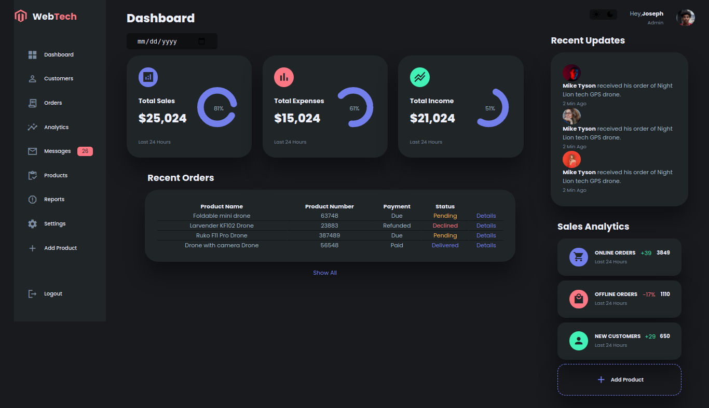

# Responsive-dashboard-using-Html-css-javascript
A modern Admin dashboard with dark and light mode  built with HTML ,CSS and javascript.
Technologes used:
-Html
-css
-Javascript

I used css variable,css Grid,css flexbox and media queries for responsive design.
css transsition  and animation for some cool animation effects.

